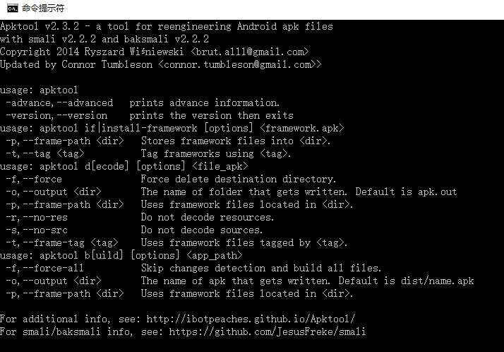

按照note.md文件下载完成apktool.jar和apktool.bat，再开始按照如下步骤开始反编译apk
当完成以上步骤之后,我们 window +R－＞打开 cmd 窗口

1.运行 apktool 命令 出现了 apktool 的版本号和指导的命令

2.随便找来一个 apk ,尝试反编译一下,运行 apktool d -f c:\test.apk -o c:\test 命令,把 test.apk 反编译,反编译后的文件放入 c 盘下的 test 文件中

名称	存放内容
assets	(未被编译)项目的assets文件夹
res	(未被编译)项目的res文件夹 里面可以清楚的看到values, layout, drawble,anim,mipmap文件夹
smali	(被编译)项目的Java文件,这里表现的不是.Java格式,是.smali格式

造成这个现象的原因是:

Android 的 assets 和 res 文件都不会编译为二进制文件,所以反编译后,基本都是能看到它的全貌.

Android 中 .Java 文件,在 JVM 编译之后变成 .class 文件,然后再经过Android 的虚拟机 Dalvik,代码编译为 .smali 文件

smali 是另外一种语言,和汇编是有点像的,涉及寄存器操作等,下面是一个截图,对于我来说,只能是大概能看懂:
